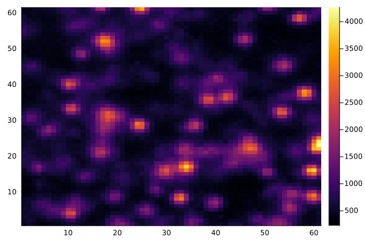
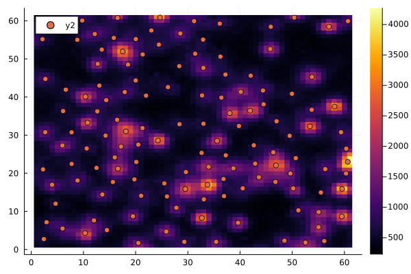

# Example Fitting with ADCG

*note: this example is generated from a jupyter notebook. Both a [local](https://github.com/CaiGroup/SeqFISH_ADCG.jl/tree/master/example_notebooks) and a [google colab](https://colab.research.google.com/github/CaiGroup/SeqFISH_ADCG.jl/blob/master/example_notebooks/colab/example_FitDots.jl.ipynb) version are available.*

This example uses images from the 561 channel in position 4 of replicate 2, to be consistent with the companion packages.


```julia
using Pkg
Pkg.activate(".")
Pkg.instantiate()
```
    


```julia
using Plots
using SeqFISH_ADCG
using FileIO
using Images
using CSV
```

Load example data


```julia
ro_img = load("../example_data/ro_preprocessed.png")
ro_img = reinterpret.(UInt16, channelview(ro_img));
```

Set Parameters


```julia
sigma_lb = 0.87
sigma_ub = 1.22
tau = 2.0*10^12
final_loss_improvement = 1000.0
min_weight = 800.0
max_iters = 200
max_cd_iters = 20
threshold = 0.0;
```

For expediancy of the demonstration, we will choose a small example tile to run ADCG on


```julia
example_tile = ro_img[1020:1080, 1220:1280]
heatmap(example_tile)
```




Now we run ADCG on the tile sample tile


```julia
inputs = (example_tile, sigma_lb, sigma_ub, threshold, tau, final_loss_improvement, min_weight, max_iters, max_cd_iters, "ADCG")
ps = fit_tile(inputs)
heatmap(example_tile)
scatter!(ps.last_iteration.x, ps.last_iteration.y)
```




ADCG appears to pick up all of the dots. It may have a few extra, but it better to tune the parameters such that too many dots are picked up than too few because [SeqFISHSyndromeDecoding](https://github.com/CaiGroup/SeqFISHSyndromeDecoding) is very effective at discarding bad dots.

Running ADCG on a whole image requires breaking up the image into overlapping tiles, running ADCG on each tile, and piecing the tiles back together. All of the Cai Lab's microscopes use 2048X2048 cameras, so `SeqFISH_ADCG` comes with a special function, ```fit_2048x2048_img_tiles```, that breaks 2048 images up into tiles. (Warning: this function will take a few hours)


```julia
points_with_duplicates, records = fit_2048x2048_img_tiles(ro_img, sigma_lb, sigma_ub, tau, final_loss_improvement, min_weight, max_iters, max_cd_iters, threshold, fit_alg="ADCG");
```

    


```julia
println(first(points_with_duplicates, 5))
```

    5×4 DataFrame
     Row   x        y         s        w        
         │ Float64  Float64   Float64  Float64  
    ─────┼──────────────────────────────────────
       1 │ 36.7463  21.5771      1.22  1123.93
       2 │ 48.8036   7.45135     1.22  1124.78
       3 │  2.3487  33.7485      1.22   969.781
       4 │ 23.1862  68.0156      1.22   957.648
       5 │ 55.7508  48.5569      1.22   966.081
    

If you have images that are not of 2048x2048 pixels, you will need to use ```fit_img_tiles```, which ```fit_2048x2048_img_tiles``` wraps, and specify your own tile and overlap size. For example ```fit_2048x2048_img_tiles``` calls (again taking hours):


```julia
tile_width = 64
tile_overlap = 6

points_with_duplicates2, records = fit_img_tiles(ro_img, tile_width, tile_overlap, sigma_lb, sigma_ub, tau, final_loss_improvement, min_weight, max_iters, max_cd_iters, threshold, fit_alg="ADCG")
```


```julia
println(first(points_with_duplicates2, 5))
```


    5×4 DataFrame
     Row   x        y         s        w        
         │ Float64  Float64   Float64  Float64  
    ─────┼──────────────────────────────────────
       1 │ 36.7463  21.5771      1.22  1123.93
       2 │ 48.8036   7.45135     1.22  1124.78
       3 │  2.3487  33.7485      1.22   969.781
       4 │ 23.1862  68.0156      1.22   957.648
       5 │ 55.7508  48.5569      1.22   966.081
  

You will need to ensure that the width and height of your image is divisible by ```tile_width```.

The next step is that you will need to remove dots that are too close to each other. This removes duplicates that are in the overlapping regions of the tiles, or may have just been fit twice by ADCG


```julia
min_allowed_separation=2.0
points = remove_duplicates(points_with_duplicates, ro_img, sigma_lb, sigma_ub, tau, threshold, min_allowed_separation)
first(points, 5)
```
    5×4 DataFrame
     Row   x        y         s        w        
         │ Float64  Float64   Float64  Float64  
    ─────┼──────────────────────────────────────
       1 │ 36.7463  21.5771      1.22  1123.93
       2 │ 48.8036   7.45135     1.22  1124.78
       3 │  2.3487  33.7485      1.22   969.781
       4 │ 55.7508  48.5569      1.22   966.081
       5 │ 61.7856  56.0963      1.22   893.048


```julia
CSV.write("example_fit.csv", points)
```


    "example_fit.csv"


